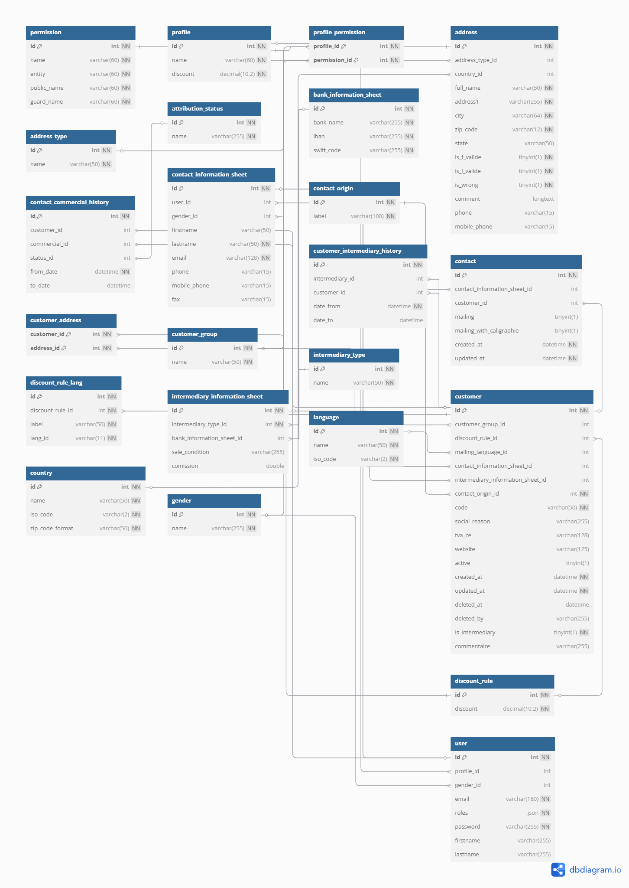

# Contact & Customer Module

## Purpose
Manages client data, intermediaries, and address book functionality.

## Conception


## Key Tables
```sql
Contact (id, firstname, lastname, email, phone)
Customer (id, social_reason, tva_ce, is_intermediary)
Address (id, full_name, city, zip_code, country_id)
CustomerContact (customer_id, contact_id)