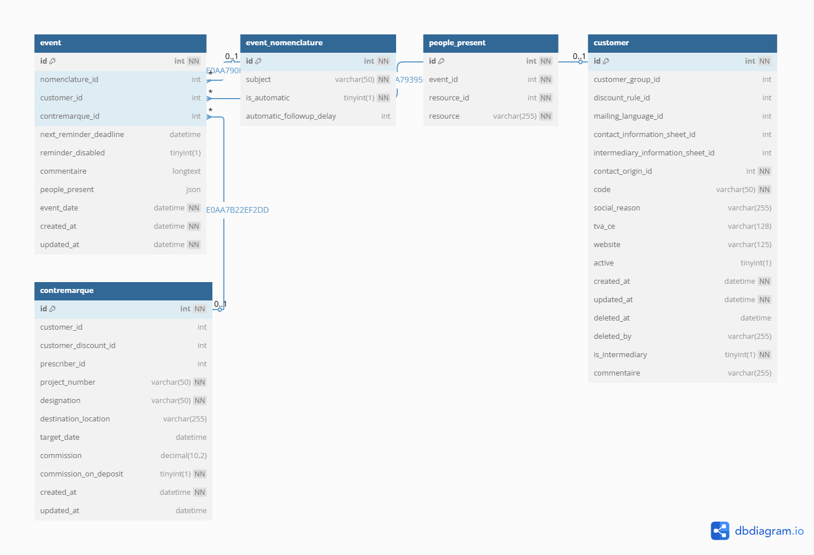

# Event Module

## Purpose
The Event module tracks all customer interactions and system milestones:

Client meetings and showroom visits

Project deadlines and reminders

Automated follow-up scheduling

## Conception


## Key Tables
```sql
Event (
  id INT PK,
  customer_id INT FK REFERENCES Customer(id),
  contremarque_id INT FK REFERENCES Contremarque(id),
  nomenclature_id INT FK REFERENCES EventNomenclature(id),
  event_date DATETIME NOT NULL,
  next_reminder DATETIME,
  reminder_disabled BOOLEAN DEFAULT FALSE,
  people_present JSON)

EventNomenclature (
  id INT PK,
  subject VARCHAR(50) NOT NULL,
  automatic_followup_delay INT)

PeoplePresent (
  id INT PK,
  event_id INT FK REFERENCES Event(id),
  resource_type VARCHAR(50), -- 'User' or 'Contact'
  resource_id INT)