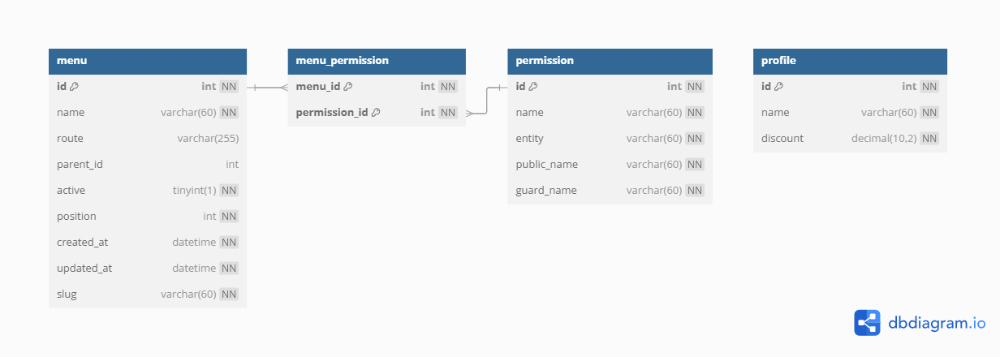

# Menu Module

## Purpose
The Menu module controls system navigation and access permissions through:

Dynamic UI rendering based on user roles

Hierarchical organization of features

Permission-to-route mapping

## Conception


## Key Tables
```sql
Menu (
  id INT PK,
  name VARCHAR(60) NOT NULL,
  route VARCHAR(255),
  parent_id INT FK REFERENCES Menu(id),
  position INT NOT NULL,
  active BOOLEAN DEFAULT TRUE,
  icon VARCHAR(30)
  
Permission (
  id INT PK,
  name VARCHAR(60) UNIQUE,
  entity VARCHAR(60) NOT NULL,
  guard_name VARCHAR(60))

MenuPermission (
  menu_id INT FK REFERENCES Menu(id),
  permission_id INT FK REFERENCES Permission(id),
  PRIMARY KEY (menu_id, permission_id))