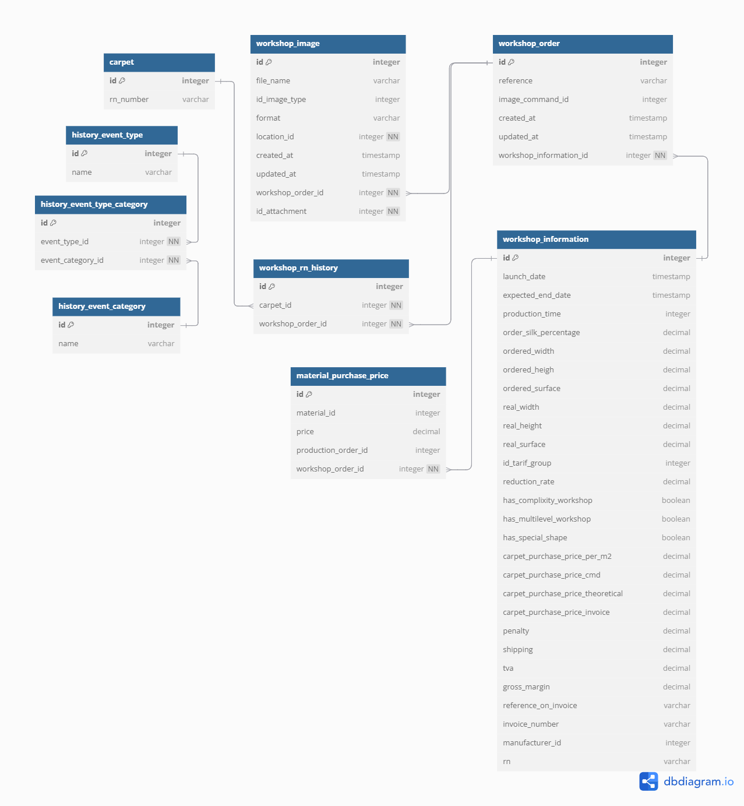

# Workshop Module

## Purpose

Manages workshop Command

## Conception



## Key Tables

```sql
workshop_order (`id`, `workshop_information_id`, `reference`, `image_command_id`, `created_at`, `updated_at`)
workshop_information(`id`, `launch_date`, `expected_end_date`, `date_end_atelier_prev`, `production_time`, `order_silk_percentage`, `ordered_width`, `ordered_heigh`, `ordered_surface`, `real_width`, `real_height`, `real_surface`, `id_tarif_group`, `reduction_rate`, `upcharge`, `comment_upcharge`, `carpet_purchase_price_per_m2`, `carpet_purchase_price_cmd`, `carpet_purchase_price_theoretical`, `carpet_purchase_price_invoice`, `penalty`, `shipping`, `tva`, `gross_margin`, `reference_on_invoice`, `invoice_number`, `manufacturer_id`, `rn`)
workshop_image(`id`, `location_id`, `workshop_order_id`, `id_attachment`, `file_name`, `id_image_type`, `format`, `created_at`, `updated_at`)
workshop_rn_history(`id`, `event_type_id`, `location_id`, `customer_id`, `workshop_order_id`, `begin_at`, `end_at`, `created_at`, `updated_at`, `carpet_id`) 
history_event_type(`id`, `name`)
history_event_category(`id`, `name`)
history_event_type_category(`id`, `event_type_id`, `event_category_id`)
workshop_rn_history(`id`, `event_type_id`, `location_id`, `customer_id`, `workshop_order_id`, `begin_at`, `end_at`, `created_at`, `updated_at`, `carpet_id`)
carpet(`id`, `rn_number`)